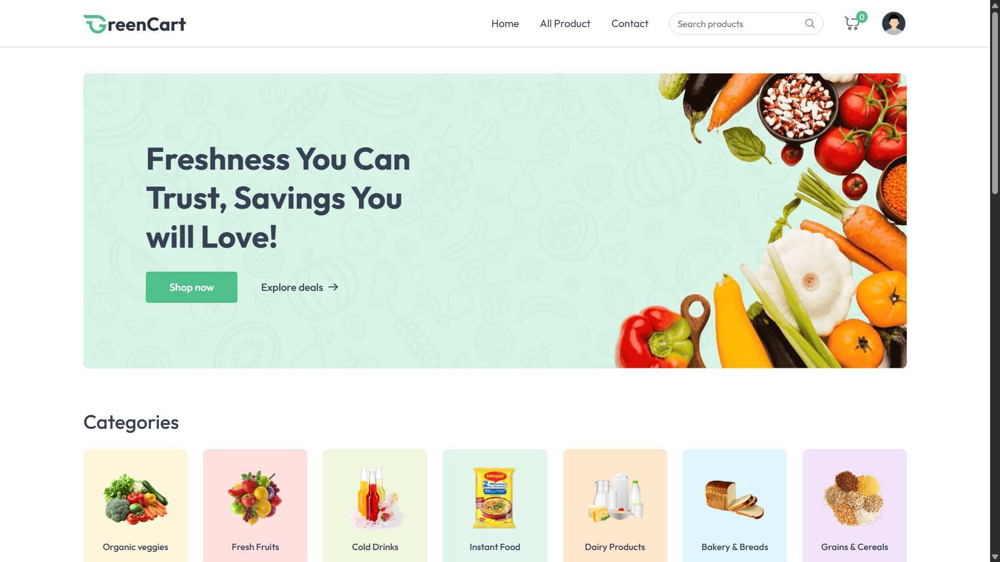
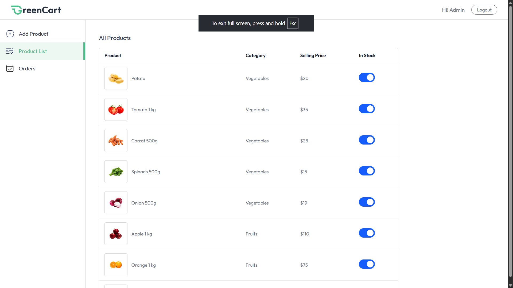
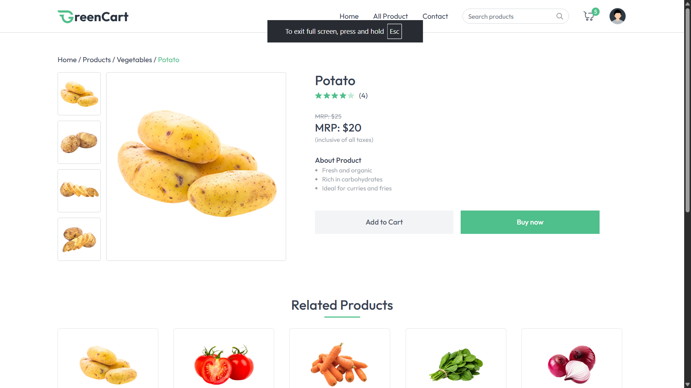
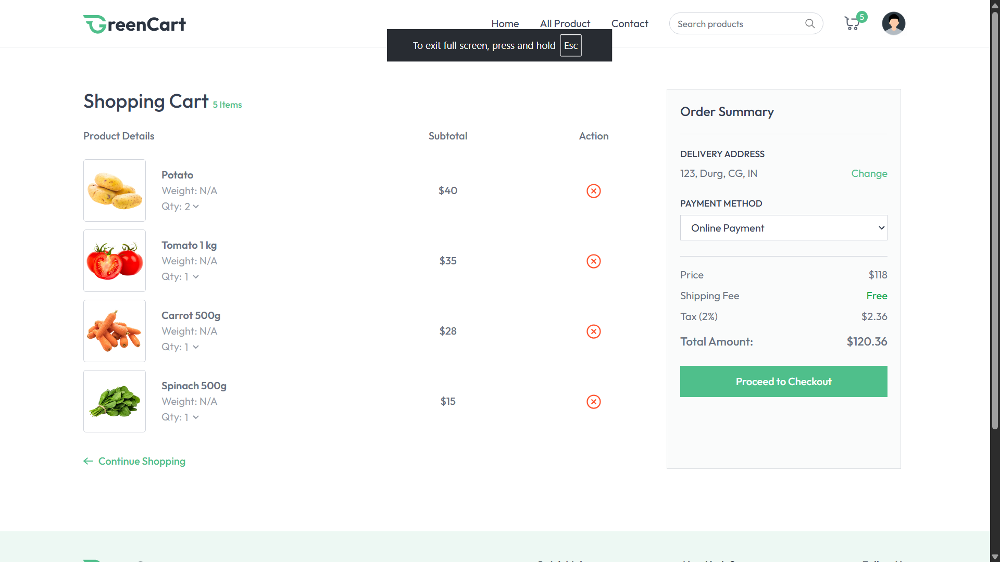
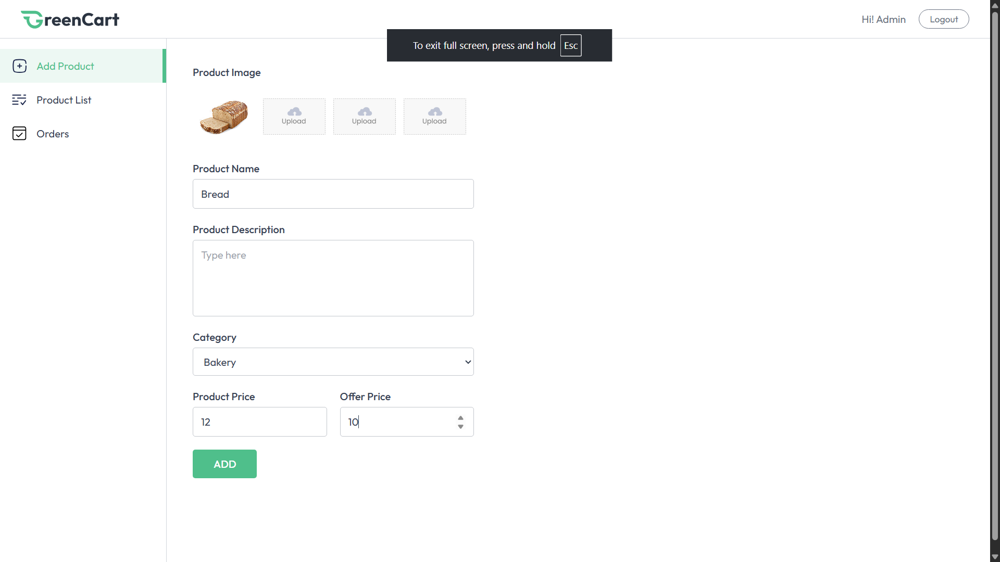
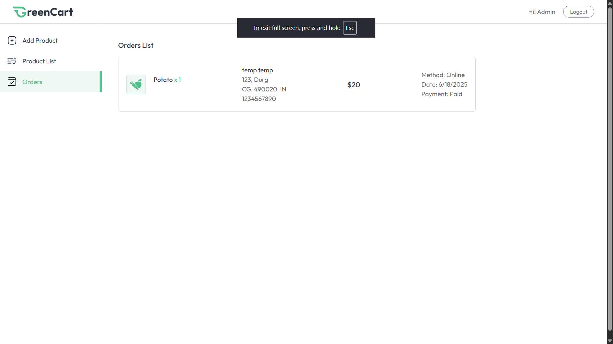
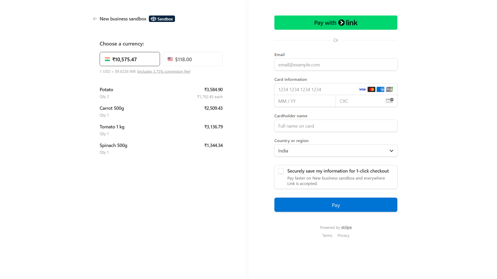

# GreenCart - Sustainable E-commerce Platform

A full-stack e-commerce application built with React and Node.js, connecting eco-conscious consumers with sustainable products.

## 🌟 Features

- User Authentication & Authorization
- Product Management
- Shopping Cart
- Secure Payments with Stripe
- Order Management
- Seller Dashboard
- Responsive Design

## 🛠️ Tech Stack

- **Frontend**: React, Vite, Tailwind CSS
- **Backend**: Node.js, Express
- **Database**: MongoDB
- **Payment**: Stripe
- **Deployment**: Vercel

## 📸 Screenshots

### Home Page


### Product Listing


### Product Details


### Shopping Cart


### Seller Dashboard


### Orders Management


### Payment Integration


## 🚀 Live Demo

Visit the live application: [GreenCart](https://greencart-deploy-ltkg.vercel.app/)

## 🔧 Installation

1. Clone the repository
```bash
git clone https://github.com/Shubham26sd/greencart-deploy.git
```

2. Install dependencies
```bash
# Install server dependencies
cd server
npm install

# Install client dependencies
cd ../client
npm install
```

3. Set up environment variables
```bash
# Server (.env)
MONGODB_URI=your_mongodb_uri
JWT_SECRET=your_jwt_secret
STRIPE_SECRET_KEY=your_stripe_secret_key

# Client (.env)
VITE_API_URL=your_api_url
```

4. Run the application
```bash
# Run server
cd server
npm run dev

# Run client
cd ../client
npm run dev
```

## 📝 API Documentation

### Authentication
- POST `/api/user/register` - Register new user
- POST `/api/user/login` - User login
- POST `/api/seller/login` - Seller login

### Products
- GET `/api/product` - Get all products
- GET `/api/product/:id` - Get product details
- POST `/api/product` - Add new product (seller only)
- PUT `/api/product/:id` - Update product (seller only)
- DELETE `/api/product/:id` - Delete product (seller only)

### Cart
- GET `/api/cart` - Get cart items
- POST `/api/cart` - Add to cart
- PUT `/api/cart/:id` - Update cart item
- DELETE `/api/cart/:id` - Remove from cart

### Orders
- GET `/api/order` - Get user orders
- POST `/api/order` - Create new order
- GET `/api/order/seller` - Get seller orders

## 🤝 Contributing

Contributions are welcome! Please feel free to submit a Pull Request.

## 👥 Authors

- [Shubham Das](https://github.com/Shubham26sd) 